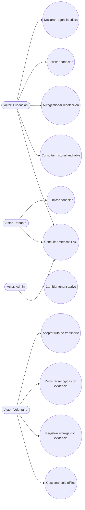
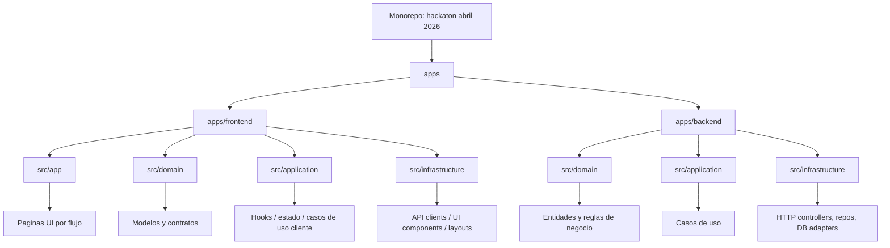

# Entregable Hackathon - RURA (Red Urbana de Rescate Alimentario)

## 1. Resumen Ejecutivo (200 a 300 palabras)
Neiva enfrenta una paradoja alimentaria critica: mientras toneladas de alimentos aptos para consumo se desperdician cada semana, miles de personas viven con inseguridad alimentaria y acceso irregular a raciones nutritivas. Este desbalance no es solo social, tambien es ambiental: el desperdicio incrementa emisiones de gases de efecto invernadero y presiona de forma innecesaria la cadena logistica urbana.

RURA (Red Urbana de Rescate Alimentario) se propone como un ecosistema logistico multi-tenant proactivo para coordinar en tiempo real a tres poblaciones objetivo: fundaciones que distribuyen alimentos, donantes naturales y juridicos con excedentes recuperables, y voluntarios que ejecutan rutas de transporte y entrega.

La plataforma integra georreferenciacion, trazabilidad por estado logistico, gestion de urgencias, historial auditable de recepcion, notificaciones en tiempo real y soporte offline para mantener continuidad operativa aun con conectividad limitada. Su arquitectura separa backend hexagonal y frontend con Clean Architecture, facilitando escalabilidad por tenant y aislamiento estricto de datos.

El impacto esperado es doble: mejorar la seguridad alimentaria en Neiva al aumentar la velocidad de rescate y distribucion, y reducir la huella de carbono asociada al desperdicio de comida con mediciones alineadas a supuestos FAO (kg rescatados, CO2 evitado y raciones generadas). Asi, RURA transforma excedentes en valor social verificable y accion climatica local.

## 2. Arquitectura del Sistema (SAD)

### 2.1 Contexto y alcance
- Sistema SaaS multi-tenant para rescate de alimentos en Neiva.
- Actores principales: Donante, Fundacion, Voluntario, Administrador de Plataforma.
- Limites: operacion urbana, trazabilidad de donacion de punta a punta, soporte online/offline.

### 2.2 Modelo UML (Casos de Uso)

### 2.3 Diagrama de Paquetes (Monorepo)

### 2.4 Estilo arquitectonico
- Backend: Arquitectura Hexagonal (Ports and Adapters).
  - Domain: entidades puras y reglas.
  - Application: casos de uso (orquestacion).
  - Infrastructure: adaptadores HTTP y persistencia.
- Frontend: Clean Architecture.
  - Domain: modelos y contratos.
  - Application: hooks y logica de aplicacion.
  - Infrastructure: componentes UI, consumo API, layouts y animaciones.

### 2.5 Atributos de calidad
- Resiliencia (Modo Offline)
  - Cola local de sincronizacion para fotos/cambios pendientes.
  - Reintento manual y sincronizacion al recuperar conectividad.
- Escalabilidad (Multi-tenant)
  - Selector de tenant global en shell operativo.
  - Aislamiento de contexto por tenant en cada operacion.
- Seguridad (Aislamiento de datos)
  - Headers de contexto (tenant y usuario) en llamadas.
  - Separacion de datos y operaciones por tenant activo.

## 3. Explicacion del Componente Tecnologico

### 3.1 Lenguajes y frameworks
- TypeScript (tipado estricto).
- Next.js (frontend app router).
- Node.js + Express (backend API).

### 3.2 APIs y servicios
- Google Maps API
  - Georreferenciacion de puntos de recoleccion.
  - Visualizacion de ruta origen-destino para logistica.
- MongoDB
  - Persistencia de entidades de operacion y trazabilidad.
  - Modelo apto para datos geo y consultas por tenant.

### 3.3 Librerias clave
- GSAP: animacion de contadores e ingreso de vistas.
- Tailwind CSS: sistema de UI utility-first coherente y responsive.
- HTML5 Camera API: captura de evidencia para recogida y entrega.

### 3.4 Metodologia de impacto ambiental (FAO)
- KPIs implementados:
  - Kilogramos rescatados.
  - CO2 evitado.
  - Raciones generadas.
- Supuestos base alineados a estandares operativos FAO definidos en el proyecto.

## 4. Soporte Tecnico

### 4.1 Repositorio
- URL: https://github.com/Thesergioandres/essenceHackthonAbril

### 4.2 Mockups
- Stitch (fuente principal): https://stitch.withgoogle.com/projects/4786455529091043472
- Capturas: ver carpeta docs/mockups

### 4.3 Evidencia verificable
- Historial de commits del dia: ver docs/evidencia/commits-2026-04-15.md
- Comando de verificacion:
  - `git log --since="2026-04-15 00:00" --pretty=format:"%h | %ad | %an | %s" --date=iso`

---

## Anexo breve para presentacion oral (30-45 segundos)
RURA conecta donantes, fundaciones y voluntarios en un flujo logistico trazable, multi-tenant y resiliente offline. El sistema prioriza urgencias, registra evidencia de recogida/entrega y mide impacto ambiental con indicadores FAO. Su arquitectura (Hexagonal + Clean) permite evolucion rapida del producto, aislamiento de datos por organizacion y una operacion confiable para escalar el rescate alimentario en Neiva.
